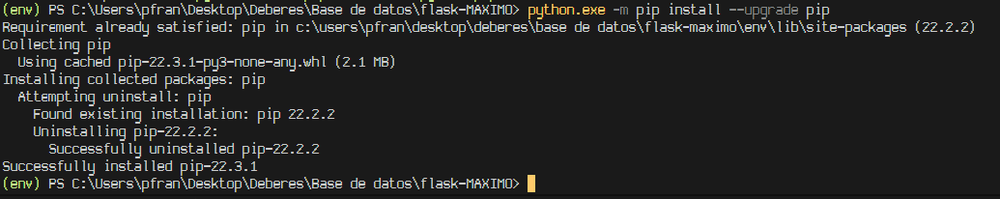

<html><head><meta content="text/html; charset=UTF-8" http-equiv="content-type"></head><body class="c37 doc-content">
SQLAlchemy con Flask

Este documento explica como hacer peticiones SQLAlchemy con Python usando el Framework Flask.

Yo utilizar&eacute; el IDE de Visual Studio Code (VSC) para realizar esta pr&aacute;ctica.

Como dice nuestra se&ntilde;ora wikipedia Flask es una Framework minimalista basado en python que nos permite a los programadores crear aplicaciones web f&aacute;cil y r&aacute;pidamente.

from&nbsp;flask&nbsp;import&nbsp;Flask

app =&nbsp;Flask(__name__)

@app.route(&quot;/&quot;)

def&nbsp;holamundo():

&nbsp; &nbsp; return&nbsp;&quot;&iexcl;Hola Mundo!&quot;

if __name__==&#39;__main__&#39;:

&nbsp; &nbsp; app.run()

Este peque&ntilde;o fragmento de c&oacute;digo es la iniciaci&oacute;n del mismo haciendo un mini servidor en el puerto 5000.

SQLAlchemy es una herramienta de mapeado, cosa que nos permite crear bases de datos y manipular las mismas sin usar SQL.

Vamos al proceso de aprender a usar Flask, luego aprender a usar SQLite, despu&eacute;s aprender a usar SQLAlchemy y finalmente hacer peticiones a una base de datos de SQLAlchemy.
<h1 class="c26" id="h.g9zd46xg69z3">FLASK</h1><h4 class="c18" id="h.6eameq7g1aks">1- Como instalar Flask</h4>
Para usar flask de la mejor forma posible necesitamos un entorno de desarrollo virtual dentro de una carpeta de nuestro ordenador.

Para ello accedemos desde visual studio a la carpeta donde trabajaremos y pondremos:

python -m venv ./env

Donde ponemos python para que identifique que es un comando de python ya que venv no existe dentro de la terminal.

venv es el comando para crear environment virtual

Al final elegimos la carpeta donde se va a crear yo pongo ./env porque quiero que me cree una carpeta con env.

Y pues nos crea una carpeta con el environment virtual donde trabajaremos con Flask.

Dentro de ./env se crean varias carpetas.

./env/Include

./env/Lib

./env/Scripts

./env/pyvenv.cfg

Para iniciar este entorno virtual tenemos que activar los permisos de ejecuci&oacute;n de powershell.

Para ello abrimos un powershell en modo administrador y ponemos estos comandos.

Get-ExecutionPolicy -List para ver los permisos que hay.

Set-ExecutionPolicy RemoteSigned -Scope CurrentUser para poner al usuario actual permiso de ejecutar scripts.

Luego volvemos a usar el primer comando para comprobar que el permiso ha sido dado correctamente.

As&iacute; deber&iacute;a ser el resultado final de los comandos.

Para activar el entorno virtual entramos dentro del archivo ./env/Scripts/activate

Dentro del entorno podemos trabajar con los archivos dentro del mismo.

Para ver las librer&iacute;as instaladas dentro de nuestro entorno virtual usamos el comando pip list.

Como vemos solo tenemos pip y setuptools&nbsp;instalados adem&aacute;s de tener que actualizar el pip.

Pues actualizamos con el comando python.exe -m pip install --upgrade pip&nbsp;y acto seguido instalamos flask con el comando pip install flask.

Ya instalada la librer&iacute;a de flask volvemos a usar pip list para ver los paquetes instalados.

Bien, tenemos todas las librer&iacute;as que usa&nbsp;flask.

Dicho esto tenemos flask&nbsp;instalado dentro de nuestro entorno virtual&nbsp;y listo para usar.

<h4 class="c18" id="h.okw3cgdr3cxv">2- C&oacute;mo usar Flask</h4>
Creamos este &aacute;rbol de carpetas para aprovechar flask.
<ul class="c12 lst-kix_rjtlqbwtigex-0 start"><li class="c0 c16 li-bullet-0">app</li></ul><ul class="c12 lst-kix_rjtlqbwtigex-1 start"><li class="c0 c30 li-bullet-0">templates</li><li class="c0 c30 li-bullet-0">app.py</li></ul><ul class="c12 lst-kix_rjtlqbwtigex-0"><li class="c0 c16 li-bullet-0">env</li></ul>

Esto porque comandos identifican templates como plantillas para usar HTML junto a python.

Jinja2 tambi&eacute;n utiliza esta carpeta.

En nuestro archivo de python (app.py) empezamos con el fragmento de c&oacute;digo de inicio anteriormente mencionado.

Podemos ejecutarlos y nos dar&aacute; esto:

Si vamos a la ip junto al puerto mencionado nos saldra esto:

Esto demuestra que por ahora todo funciona correctamente.

<h1 class="c26" id="h.rl1l8ifs6hla">SQLAlchemy</h1><h4 class="c18" id="h.m7zfomaljor8">1- Instalar SQLAlchemy</h4>
No tenemos que instalar SQLAlchemy propiamente dicho sino la versi&oacute;n que conecta junto con flask, el comando de instalaci&oacute;n es este:

pip install flask-sqlalchemy

Instalado esto ya podemos trabajar con Flask y con SQLAlchemy en nuestro entorno virtual.
<h4 class="c18" id="h.wlch806fm27m">2- Crear tablas en SQLAlchemy</h4>
Para crear tablas primero tenemos que importar Flask y flask_sqlalchemy&nbsp;dentro de nuestro archivo.

Luego configuramos la app

Diciendo que el nombre es basado en Flask

Que la uri de la database estar&aacute; en el mismo directorio y se llamar&aacute; sqlite:///db.sqlite3

Y en el mapeado de las modificaciones lo desactivamos puesto a que para lo que vamos a hacer estorba m&aacute;s que ayudar.

Creamos tablas con clases, el nombre de la tabla, remarcar que es un modelo de database.

El tutorial requiere que creemos 3 tablas: Clientes, Ordenes, Productos

Ahora en cada columna creamos un valor llamado ID la cual ser&aacute; nuestra clave primaria para cada dato que insertemos.

id = db.Column(db.Integer, primary_key=True)

Remarcando que ser&aacute; una columna en la configuraci&oacute;n de la misma ponemos que ser&aacute; un INT y clave primaria.

Configuramos la tabla de productos

Creamos name y price para almacenar los precios y los nombres.

Asignamos a nombre un m&aacute;ximo de 50 caracteres y que no pueda ser un NULL&nbsp;adem&aacute;s de hacer que los nombres sean &uacute;nicos y que no se puedan repetir.

Mientras que el precio lo marcamos como un INT y que no pueda ser NULL.

Configuramos la tabla de Customers.

Creamos primer nombre, apellido, direcci&oacute;n, ciudad, c&oacute;digo postal y email.

Asignamos que todos tienen un m&aacute;ximo de 50 caracteres menos address que ponemos 500.

Adem&aacute;s de hacer que no puedan ser NULL y que el email sea &uacute;nico. 

Configuramos la tabla de Orders.

Creamos fecha de orden

Fecha de embarque

Fecha de entrega

C&oacute;digo cup&oacute;n

Hacemos que el dato de fecha de orden no pueda ser NULL y que el default es la fecha de hoy.

Para eso tenemos que importar la librer&iacute;a datetime

<h4 class="c18" id="h.n65b2hw4twhq">3- Relacionar las tablas</h4>
Hacemos una clave for&aacute;nea dentro de &Oacute;rdenes para marcar el cliente que ha solicitado esa orden.

Dentro de customers creamos orders para ver todos los valores en que orders coinciden con customer.

Creamos una relaci&oacute;n de muchos a muchos entre los productos y las &oacute;rdenes.

Donde las claves for&aacute;neas son los id de ordenadores y productos y ambas son claves primarias de esta tabla relacional.

Dentro de ordenes creamos el dato de productos como relaci&oacute;n y ponen todos los productos dentro de una orden.

<h4 class="c18" id="h.pv47vnl07yn4">3- Crear base de datos</h4>
Para crear la base de datos tenemos que abrir un shell de flask con flask shell.

Para ello tenemos que poner el nombre de la aplicaci&oacute;n.

python -m env FLASK_APP=app.py

Ejecutando desde python y en el entorno asignar la app flask como app.py y dentro de la carpeta donde est&aacute; en archivo ./app/app.py ejecutar el comando flask shell.

Dentro de la instancia ejecutamos los siguientes comandos:

from app import db

Para importar todo lo relacionado a nuestra database de la app

db.create all()

Para crear todo el archivo de la database.

Nos generara el archivo donde pusimos el uri

Ahora abrimos sqlite con sus comandos en path

Y vemos que las tablas est&aacute;n correctamente creadas con .tables.

<h4 class="c18" id="h.qbwwqjga5mly">4- A&ntilde;adir datos a la base de datos</h4>
Dentro del shell de flask importamos de la aplicaciones db, y las tablas de productos ordenes y customers

Despu&eacute;s de eso creamos una variable llamada pepe con la clase Customer y a&ntilde;adimos los datos correspondientes al customer.

Despu&eacute;s de eso para a&ntilde;adirlo a base de datos tenemos que usar el comando:

db.session.add(nuestra variable)

Y luego se hacer el add con nuestro nuevo dato, hacemos el commit

db.session.commit()

Y vemos como se ha a&ntilde;adido a la base de datos pepe garcia.

De la misma forma a&ntilde;adimos un producto

Pero para la pr&aacute;ctica necesitamos dos productos en principio as&iacute; que vamos a crear un tel&eacute;fono tambi&eacute;n.

Ahora hacemos una entrada con Order

D&oacute;nde order date es automatico, coupon hemos puesto la nueva f&oacute;rmula de Jumpers para vender m&aacute;s, customer ponemos el id de pepe y productos las variables configuradas.

Son nuevas porque con las anteriores no guarde y pues tuve que crear nuevas.

Vemos como se ha creado la orden correctamente.

La tabla de relaci&oacute;n entre &oacute;rdenes y productos tambi&eacute;n se ha creado sin ning&uacute;n tipo de problema.
<h5 class="c40" id="h.bme8fnxha6n8">4.1- Actualizar datos dentro de la base de datos</h5>
Para extraer como variable a por ejemplo un customer tenemos que hacer:

Customer.query.filter_by(id=1).first()

Donde Customer es la tabla de la cual vamos a extraer los nombres.

Query es para saber que vamos a hacer una petici&oacute;n.

Filter_by para que filtre mediando una o varias condiciones en este caso con la id porque es &uacute;nica y solo nos dar&aacute; al customer que queremos.

Y first&nbsp;para que nos de solo el primero para que sea m&aacute;s limpio todo.

Y para actualizar un dato es mucho mas simple, al ser un objeto solo tienes que hacer:

Y as&iacute; se cambia el valor.

Para guardarlo hay que usar el commit() directamente.

<h5 class="c40" id="h.huax0rbagthz">4.2 Eliminar datos dentro de la base de datos</h5>
Para la practica de eliminar entradas de la base de datos tenemos que crear otro customer para borrarlo.

Yo lo he llamado felipe

Lo buscamos mediante su id como antes.

Luego con el comando db.session.delete(variable) borramos de la existencia al customer.

Captura de que no existe no es de antes lo prometo.

Bien bien bien, ya sabemos manejarnos con SQLAlchemy, llega el momento de hacer Queries como enfermitos.

<h1 class="c26" id="h.cxs4yrwwctdu">Query</h1>
Para rellenar las bases de datos el tutorial nos brinda una serie de funciones con las cuales se generan datos de manera aleatoria por lo tanto nos facilita y adelanta mucho trabajo.

#generadores

def&nbsp;add_customers():

&nbsp; &nbsp; for&nbsp;_ in&nbsp;range(100):

&nbsp; &nbsp; &nbsp; &nbsp; customer =&nbsp;Customer(

&nbsp; &nbsp; &nbsp; &nbsp; &nbsp; &nbsp; first_name=fake.first_name(),

&nbsp; &nbsp; &nbsp; &nbsp; &nbsp; &nbsp; last_name=fake.last_name(),

&nbsp; &nbsp; &nbsp; &nbsp; &nbsp; &nbsp; address=fake.street_address(),

&nbsp; &nbsp; &nbsp; &nbsp; &nbsp; &nbsp; city=fake.city(),

&nbsp; &nbsp; &nbsp; &nbsp; &nbsp; &nbsp; postcode=fake.postcode(),

&nbsp; &nbsp; &nbsp; &nbsp; &nbsp; &nbsp; email=fake.email()

&nbsp; &nbsp; &nbsp; &nbsp; )

&nbsp; &nbsp; &nbsp; &nbsp; db.session.add(customer)

&nbsp; &nbsp; db.session.commit()

def&nbsp;add_orders():

&nbsp; &nbsp; customers =&nbsp;Customer.query.all()

&nbsp; &nbsp; for&nbsp;_ in&nbsp;range(1000):

&nbsp; &nbsp; &nbsp; &nbsp; #choose a random customer

&nbsp; &nbsp; &nbsp; &nbsp; customer =&nbsp;random.choice(customers)

&nbsp; &nbsp; &nbsp; &nbsp; ordered_date =&nbsp;fake.date_time_this_year()

&nbsp; &nbsp; &nbsp; &nbsp; shipped_date =&nbsp;random.choices([None,&nbsp;fake.date_time_between(start_date=ordered_date)],&nbsp;[10,&nbsp;90])[0]

&nbsp; &nbsp; &nbsp; &nbsp; #choose either random None or random date for delivered and shipped

&nbsp; &nbsp; &nbsp; &nbsp; delivered_date =&nbsp;None

&nbsp; &nbsp; &nbsp; &nbsp; if&nbsp;shipped_date:

&nbsp; &nbsp; &nbsp; &nbsp; &nbsp; &nbsp; delivered_date =&nbsp;random.choices([None,&nbsp;fake.date_time_between(start_date=shipped_date)],&nbsp;[50,&nbsp;50])[0]

&nbsp; &nbsp; &nbsp; &nbsp; #choose either random None or one of three coupon codes

&nbsp; &nbsp; &nbsp; &nbsp; coupon_code =&nbsp;random.choices([None,&nbsp;&#39;50OFF&#39;,&nbsp;&#39;FREESHIPPING&#39;,&nbsp;&#39;BUYONEGETONE&#39;],&nbsp;[80,&nbsp;5,&nbsp;5,&nbsp;5])[0]

&nbsp; &nbsp; &nbsp; &nbsp; order =&nbsp;Order(

&nbsp; &nbsp; &nbsp; &nbsp; &nbsp; &nbsp; customer_id=customer.id,

&nbsp; &nbsp; &nbsp; &nbsp; &nbsp; &nbsp; order_date=ordered_date,

&nbsp; &nbsp; &nbsp; &nbsp; &nbsp; &nbsp; shipped_date=shipped_date,

&nbsp; &nbsp; &nbsp; &nbsp; &nbsp; &nbsp; delivered_date=delivered_date,

&nbsp; &nbsp; &nbsp; &nbsp; &nbsp; &nbsp; coupon_code=coupon_code

&nbsp; &nbsp; &nbsp; &nbsp; )

&nbsp; &nbsp; &nbsp; &nbsp; db.session.add(order)

&nbsp; &nbsp; db.session.commit()

def&nbsp;add_products():

&nbsp; &nbsp; for&nbsp;_ in&nbsp;range(10):

&nbsp; &nbsp; &nbsp; &nbsp; product =&nbsp;Product(

&nbsp; &nbsp; &nbsp; &nbsp; &nbsp; &nbsp; name=fake.color_name(),

&nbsp; &nbsp; &nbsp; &nbsp; &nbsp; &nbsp; price=random.randint(10,100)

&nbsp; &nbsp; &nbsp; &nbsp; )

&nbsp; &nbsp; &nbsp; &nbsp; db.session.add(product)

&nbsp; &nbsp; db.session.commit()

&nbsp; &nbsp;

def&nbsp;add_order_products():

&nbsp; &nbsp; orders =&nbsp;Order.query.all()

&nbsp; &nbsp; products =&nbsp;Product.query.all()

&nbsp; &nbsp; for&nbsp;order in&nbsp;orders:

&nbsp; &nbsp; &nbsp; &nbsp; #select random k

&nbsp; &nbsp; &nbsp; &nbsp; k =&nbsp;random.randint(1,&nbsp;3)

&nbsp; &nbsp; &nbsp; &nbsp; # select random products

&nbsp; &nbsp; &nbsp; &nbsp; purchased_products =&nbsp;random.sample(products,&nbsp;k)

&nbsp; &nbsp; &nbsp; &nbsp; order.products.extend(purchased_products)

&nbsp; &nbsp; &nbsp; &nbsp;

&nbsp; &nbsp; db.session.commit()

def&nbsp;create_random_data():

&nbsp; &nbsp; db.create_all()

&nbsp; &nbsp; add_customers()

&nbsp; &nbsp; add_orders()

&nbsp; &nbsp; add_products()

&nbsp; &nbsp; add_order_products()

Copiamos el c&oacute;digo debajo de las clases de nuestra tablas.

Y abrimos nuestra SHELL.

All&iacute; importamos create_random_data&nbsp;y ejecutamos

&nbsp;&nbsp;&nbsp;&nbsp;&nbsp;&nbsp;&nbsp;&nbsp;

Como podemos observar todas las tablas han sido rellenadas con gran cantidad de datos aleatorios que pueden o no tener sentido.

<h4 class="c18" id="h.gdkzq6ilcgy5">1- Get All Customer Orders</h4>

Creamos una funci&oacute;n query que&nbsp;busque todas las &oacute;rdenes que ha hecho un cliente como variable tenemos el id de cliente y devolver&aacute; todas las &oacute;rdenes que coincidan con la id luego nos devolver&aacute; la fecha de la orden de cada orden.

<h4 class="c18" id="h.qodkof4rt4d7">2- Get All pending Orders</h4>

Creamos una funci&oacute;n que busque entre las &oacute;rdenes las que no tengan fecha de embarque lo que quiere decir que no han sido enviadas y relacionan completamente con pendientes luego por cara orden dentro de el listado de ordenes pendientes imprimir&aacute; la fecha de la orden.

<h4 class="c18" id="h.fey7xx288nf8">3- How many customers</h4>

Hacemos una funci&oacute;n que printe la cantidad de Customers dentro de la query.

<h4 class="c18" id="h.lbm6nymvne5i">4- Get orders with Coupon Codes</h4>

Inventamos una funci&oacute;n que busque mediante un filtro los que dentro del dato coupon_code&nbsp;no sea NULL&nbsp;as&iacute; sabemos que el resultante tiene cup&oacute;n desde aqu&iacute; filtramos los que sean diferentes a FREESHIPPING.

Imprimimos uno por uno su c&oacute;digo de cup&oacute;n.

<h4 class="c18" id="h.a1gh4gh9429m">5- Get revenue Past x days</h4>

Creamos una funci&oacute;n que suma el precio de todos los productos de todas las &oacute;rdenes que tenga una fecha de orden mayor a la fecha actual - el tiempo expresado como x.

As&iacute; obtenemos los ingresos o beneficios de ese tiempo en espec&iacute;fico. Se puede mejorar el c&oacute;digo si en vez de dejar la variable en x_day=30 quitamos el &ldquo;=30&rdquo; as&iacute; cuando ejecutemos la funci&oacute;n podremos elegir el tiempo.

<h4 class="c18" id="h.wz1gxwlsw5zd">6- Get the average fulfillment time</h4>

Hacemos una funciones que dentro de la querry busque en cada orden donde la fecha de embarque no sea NULL, de esas pilla la fecha de embarque y la resta con la fecha de orden obteniendo el tiempo tardado entre la orden y la entre y luego hace una media entre todos los otros tiempos.

<h4 class="c18" id="h.pd1f858jjmd">7- Get Customers Who Have Purchased more than x</h4>

Creamos una funci&oacute;n donde buscaremos los clientes que hayan gastado m&aacute;s de x dinero.

Para ello vamos a buscar dentro de la base de datos todos los clientes, sus &oacute;rdenes y los productos dentro de las &oacute;rdenes. Y agrupamos los clientes que tengan la suma de todo el precio de los productos mayor a amount en este caso 500.

Y vemos que esta query tambi&eacute;n se puede mejorar quitando el =500&nbsp;para que al importar podamos aplicar la variable.

Bibliograf&iacute;a

<a class="c25" href="https://www.google.com/url?q=https://en.wikipedia.org/wiki/SQLAlchemy&amp;sa=D&amp;source=editors&amp;ust=1677803565660154&amp;usg=AOvVaw1vuYoDrykZwl475zAEablg">https://en.wikipedia.org/wiki/SQLAlchemy</a>

<a class="c25" href="https://www.google.com/url?q=https://es.wikipedia.org/wiki/Flask&amp;sa=D&amp;source=editors&amp;ust=1677803565660455&amp;usg=AOvVaw276g5jiOh_b71JG_HIjwx7">https://es.wikipedia.org/wiki/Flask</a>

<a class="c25" href="https://www.google.com/url?q=https://www.cdmon.com/es/blog/la-ejecucion-de-scripts-esta-deshabilitada-en-este-sistema-te-contamos-como-actuar&amp;sa=D&amp;source=editors&amp;ust=1677803565660683&amp;usg=AOvVaw1VNxn65L1PX6karno8eTYO">https://www.cdmon.com/es/blog/la-ejecucion-de-scripts-esta-deshabilitada-en-este-sistema-te-contamos-como-actuar</a>

<a class="c25" href="https://www.google.com/url?q=https://flask-es.readthedocs.io/cli/&amp;sa=D&amp;source=editors&amp;ust=1677803565660877&amp;usg=AOvVaw2ITw5JQSOgALfD9GIf73SO">https://flask-es.readthedocs.io/cli/</a>

<a class="c25" href="https://www.google.com/url?q=https://flask.palletsprojects.com/en/2.2.x/shell/?highlight%3Dshell&amp;sa=D&amp;source=editors&amp;ust=1677803565661084&amp;usg=AOvVaw1EL4OpWPL_aRAJT0YfRE7W">https://flask.palletsprojects.com/en/2.2.x/shell/?highlight=shell</a>

<a class="c25" href="https://www.google.com/url?q=https://www.youtube.com/watch?v%3D-1DmVCPB6H8%26t%3D685s%26ab_channel%3DUskoKruM2010&amp;sa=D&amp;source=editors&amp;ust=1677803565661296&amp;usg=AOvVaw2nbHg4oJFYdTWPdpfGoRYL">https://www.youtube.com/watch?v=-1DmVCPB6H8&amp;t=685s&amp;ab_channel=UskoKruM2010</a>

<a class="c25" href="https://www.google.com/url?q=https://www.youtube.com/watch?v%3DX2r4Sky01lw%26ab_channel%3DFaztCode&amp;sa=D&amp;source=editors&amp;ust=1677803565661502&amp;usg=AOvVaw3tdticxDMAlvgTp5xd1dhX">https://www.youtube.com/watch?v=X2r4Sky01lw&amp;ab_channel=FaztCode</a>

<a class="c25" href="https://www.google.com/url?q=https://www.sqlite.org/quickstart.html&amp;sa=D&amp;source=editors&amp;ust=1677803565661679&amp;usg=AOvVaw0Ce4rnbv0vc7scUvnUTUUL">https://www.sqlite.org/quickstart.html</a>

<a class="c25" href="https://www.google.com/url?q=https://www.geeksforgeeks.org/how-to-fix-syntaxerror-positional-argument-follows-keyword-argument-in-python/&amp;sa=D&amp;source=editors&amp;ust=1677803565661908&amp;usg=AOvVaw0tS_DCri0I1s3aIoHkx2AC">https://www.geeksforgeeks.org/how-to-fix-syntaxerror-positional-argument-follows-keyword-argument-in-python/</a>

</body></html>